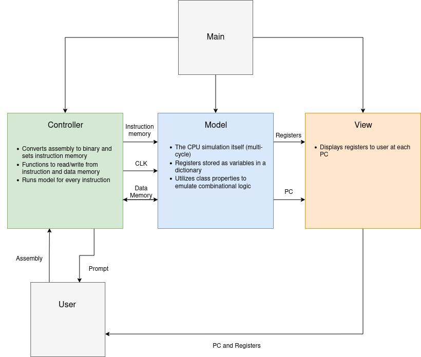

# RISC-V Python Simulation

Joseph Gilbert, Kat Canavan, and Arturo Joya

This repository contains the files used to create a command-line based simulation of a RISC-V CPU using Python. Both a debugging and educational tool, this program takes assembly as input and returns the register files after each instruction.

## Dependencies

This simulation was run and tested using Python 3.10. Prior versions of Python are not compatible.

The following libraries were used:

- bitstring 

- riscv-assembler ([GitHub](https://github.com/kcelebi/riscv-assembler)), ([Documentation](https://github.com/kcelebi/riscv-assembler))

All libraries can be installed with

```bash
pip install -r requirements.txt
```

## Using our Code

This program requires the user to be at least somewhat familiar with command line interfaces. Create a clone of this repository to your local machine and navigate to that directory in a command-line terminal. 

There are two methods of inputting RISC-V assembly code:

1. Enter instructions line-by-line, live, through the terminal and immediately see the result of each given command. Since this is live, only I Type, R Type, and S Type instructions are supported.

2. Process an entire assembly (.s) file. All instructions are processed and when the program is complete the relevant registers are displayed per step. This mode supports all RISC-V 32I instructions. 

Each of these methods are described in more detail below.

### Line By Line

To test assembly code live, a line at a time, simply run `python3 main.py`. You will be prompted to type in assembly code (e.g `addi t0, zero, 42` to store the immediate  `42` to register t0). If you choose to output verbose information (by initializing as ` `), you will be able to see the entire register.

```bash
Instruction : addi t0, zero, 42
PC : 0
+----Register File----+
|x00 | zero | 00000000|
|x01 | ra   | xxxxxxxx|
.Rest of the registers.
|x05 | t0   | 0000002A|
.Rest of the registers.
+---------------------+
```

Otherwise, you can also choose to only display the registers that have been changed so far. Assuming that `addi t0, zero, 42` was already run, typing in `addi t1, t0, 63` would result in the following output, which may be easier to follow.

```bash
Instruction : addi t1, t0, 63
PC : 4
+----Register File----+
|x05 | t0   | 0000002A|
|x06 | t1   | 00000069|
+---------------------+
```

### Assembly File

To test assembly code through a file, run `python3 main.py FILENAME.s` (where `FILENAME.s` is the filepath). This will run the simulation automatically and output the register file after executing each instruction. You can choose to output either a verbose register file or just the register files that have been altered by the specific instruction. The following is an example output from a file containing the assembly code from the Line by Line example in non-verbose display.

```bash
Instruction : addi t0, zero, 42
PC : 0
+----Register File----+
|x05 | t0   | 0000002A|
+---------------------+
Instruction : addi t1, t0, 63
PC : 4
+----Register File----+
|x05 | t0   | 0000002A|
|x06 | t1   | 00000069|
+---------------------+
```

## Our Software Design

We decided to implement this simulation using object oriented design. We followed the model-view-controller architecture to divide the program's functionality. The following is a quick breakdown of our program



Please read through the comments on our code and function docstrings for more information on precisely how the it works.